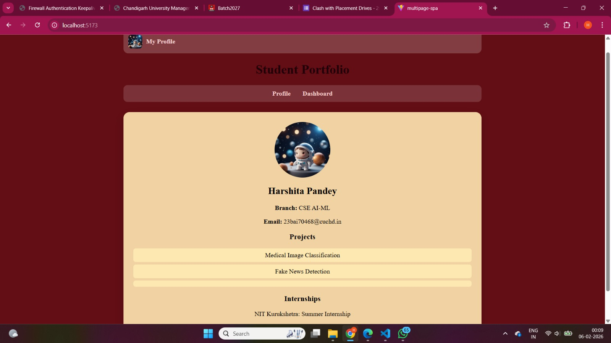
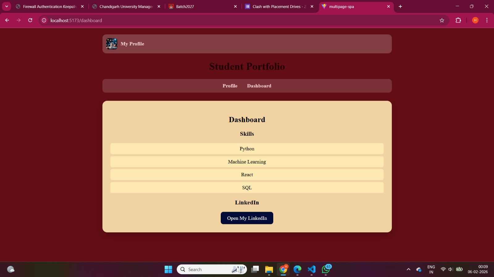
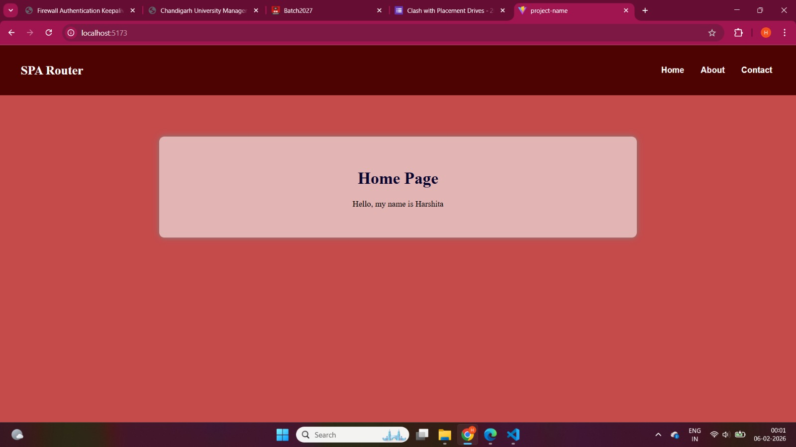
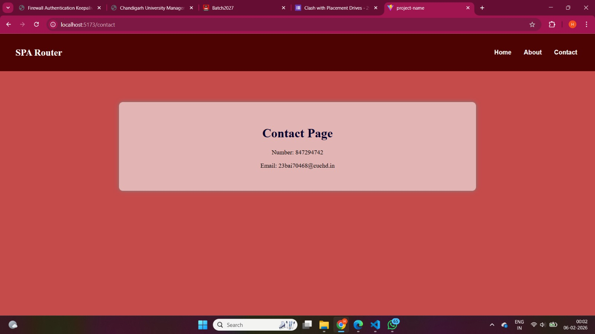

# FS_EXP3
# FS_EXP3

# MultiPage SPA using React (JavaScript)

This project is a **Multi-Page Single Page Application (SPA)** developed using **React and JavaScript**.  
It contains multiple pages like Profile and Dashboard while still working as a single-page application.

---

## 📌 Features

- Multi-page layout in a Single Page Application
- Profile page with photo, personal info, projects and internship
- Dashboard page with skills and LinkedIn section
- Component-based architecture
- Simple and clean UI
- Beginner friendly project

---

## 📂 Folder Structure

multipage-spa  
│  
├── photos  
│   ├── home.png  
│   ├── profile.png  
│   └── dashboard.png  
│  
├── public  
├── src  
│   ├── components  
│   │   ├── Profile.js  
│   │   ├── Dashboard.js  
│   │   └── Navbar.js  
│   │  
│   ├── App.js  
│   ├── index.js  
│   └── App.css  
│  
├── package.json  
└── README.md  

---

## 🖼️ Screenshots

### 🏠 Home Page


### 👤 Profile Page


### 📊 Dashboard Page


### Home Page


### About Page


### Contact Page

---

## 🚀 How To Run Project

1. Install Node Modules
```bash
npm install


